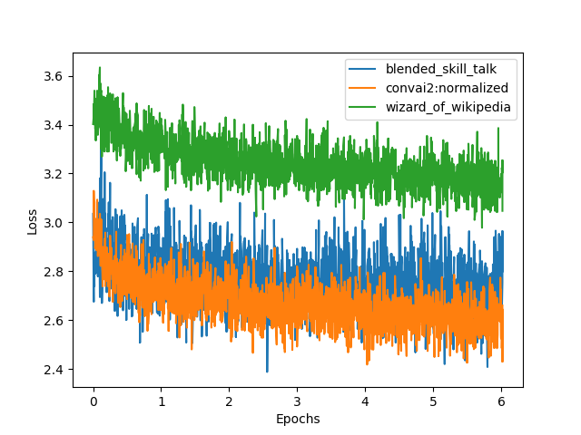

# ParlAI-Log-Parser
Parsing tool designed specifically for ParlAI logs, enabling the extraction of data for visualization using Matplotlib.

- Run your ParlAI command with and pipe the output to tee e.g. ```python3 -m parlai train_model ... | tee -a log.txt```. This will create a log.txt containing all of the output from ParlAI.
- Now you can parse the log. See ```main.py``` for reference.
- The data can then be used to plot. Here's an example of how the data can be visualized:

